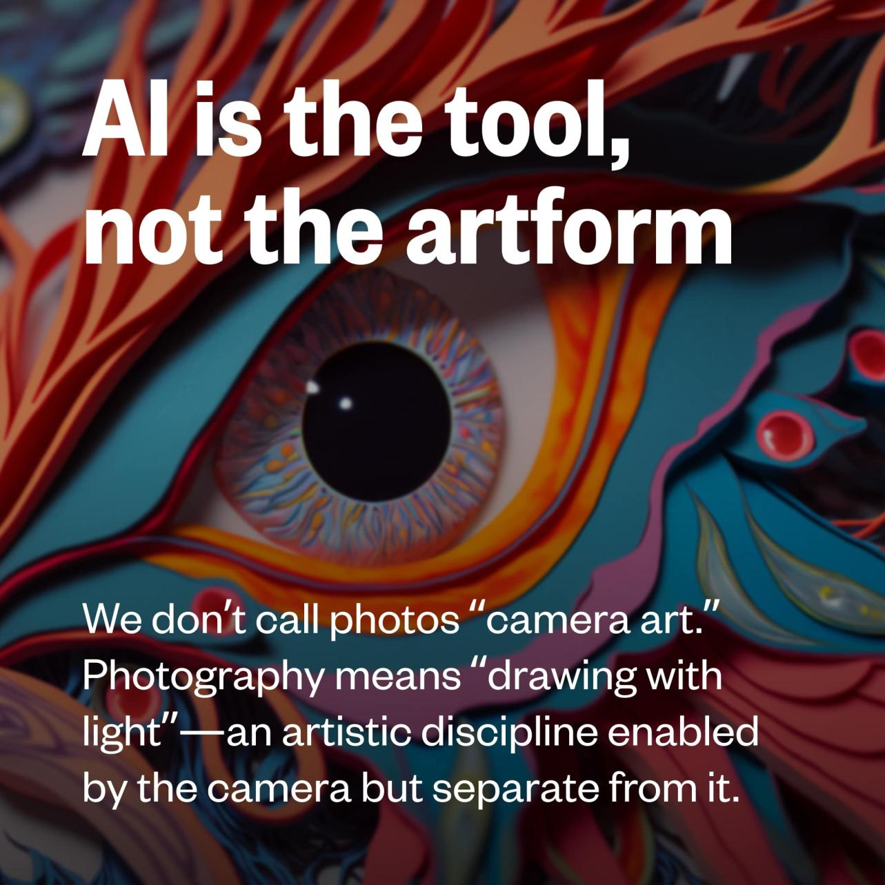

Today I heard computer-generated art described as "otherworldly". Yesterday I heard someone talk about creating AI-generated prayers.

I've always wondered why artists liked to imagine that their art wsa "inspired" by something outside of reality and beyond nature, but I naively expected that tendancy to wither and decline when purely mechanical machines demonstrated increased artistic ability.

The proponents of magical-thinking have just started to extend the "magic" to computers, instead.

There is some movement in the opposite direction, though. Some people are suggesting the term "Synthography" for AI assisted art, instead of "AI Art".

> AI is the tool, not the artform. We don't call photos "camera art". 

[BentlyARt&Design - Discord](https://discordapp.com/channels/662267976984297473/989270503925616680/1055470639932260352)

